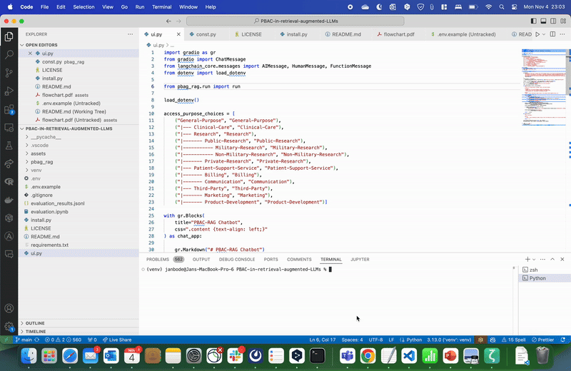
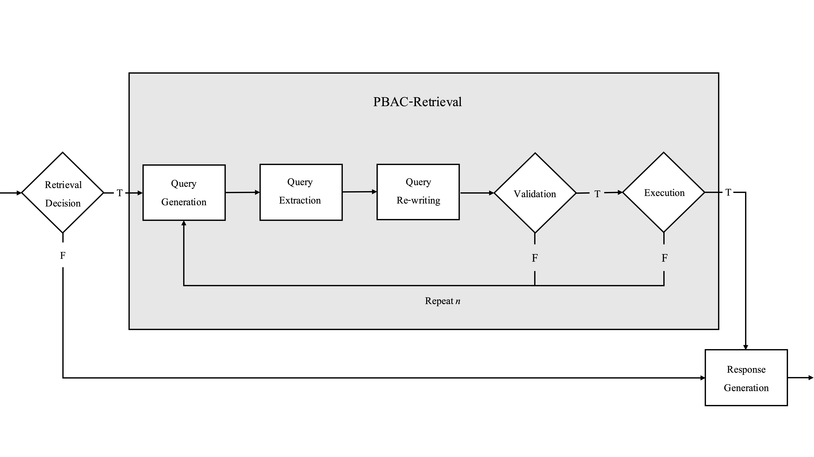

# Master Thesis: PBAC in retrieval augmented LLMs



## Description
This repository contains the source code for a exemplary Purpose-based Access Control (PBAC)-RAG application. 
The application was developed as a Proof of Concept (PoC) to illustrate the prosed architecture for a PBAC-RAG system.  




## Project Structure
```plaintext
project-root/
├── assets/                          # Directory for media assets
│   ├── demo.gif                     # Demo GIF showcasing functionality
│   └── flowchart.png                # Flowchart illustrating workflow architectural components
├── pbag_rag/                        # Main project source directory
│   ├── chat/                        # Chat module
│   │   ├── llm.py                   # Declaration of chat LLM
│   │   └── prompt.py                # Prompt template for chat LLM
│   ├── query_generation/            # Query generation module
│   │   ├── llm.py                   # Declaration of query generation LLM
│   │   └── prompt.py                # Prompt template and few-shot examples for query generation LLM 
│   ├── retrieval_decision/          # Retrieval decision module
│   │   ├── llm.py                   # Declaration of retrieval decision LLM
│   │   └── prompt.py                # Prompt template and few-shot examples for retrieval decision LLM
│   ├── const.py                     # Constants and configuration settings
│   ├── db.py                        # Database interaction utilities
│   ├── pbac.py                      # PBAC logic including validation
│   └── run.py                       # Main script to execute the PBAC-RAG application, i.e., the backend
├── .env.example                     # Example environment file template
├── .gitignore                       # Git ignore file to exclude unnecessary files
├── evaluation_results.jsonl         # JSONL file storing evaluation results
├── evaluation.ipynb                 # Jupyter notebook for evaluating model or system
├── install.py                       # Installation script for setting up dependencies
├── LICENSE                          # License file for the project
├── README.md                        # Main documentation and introduction to the project
└── requirements.txt                 # List of Python dependencies for the project
```


## Prerequisites

Python 3.9 or higher

## Setup
1. Execute the [install.py](install.py) script.

    ```bash
    python3 install.py
    ```
2. Create a ```.env``` file in the root directory.

    ```
    cp .env.example .env
    ```

3. Connect an LLM inference provider.

    a.) Add an OpenAI API key, or

    b.) add an API key for the inference provider of your choice $^{1}$

4. Setup the DB.

    a.) Request access to the demo DB at [jan.bode@campus.tu-berlin.de](jan.bode@campus.tu-berlin.de), or

    b.) follow the [instructions](https://github.com/bodejan/california-imr-pii) to setup your own DB.

5. Run the gradio app.

    ```
    python ui.py
    ```

$^1$ To change the LLM inference provider install the langchain-*provider* package and adjust the llm declarations in [1](pbag_rag/query_generation/llm.py#78), [2](pbag_rag/retrieval_decision/llm.py#L62), and [3](pbag_rag/chat/llm.py#52).

## Note

Evaluation results are provided on the [evaluation branch](https://github.com/bodejan/pbac-rag/tree/evaluation).